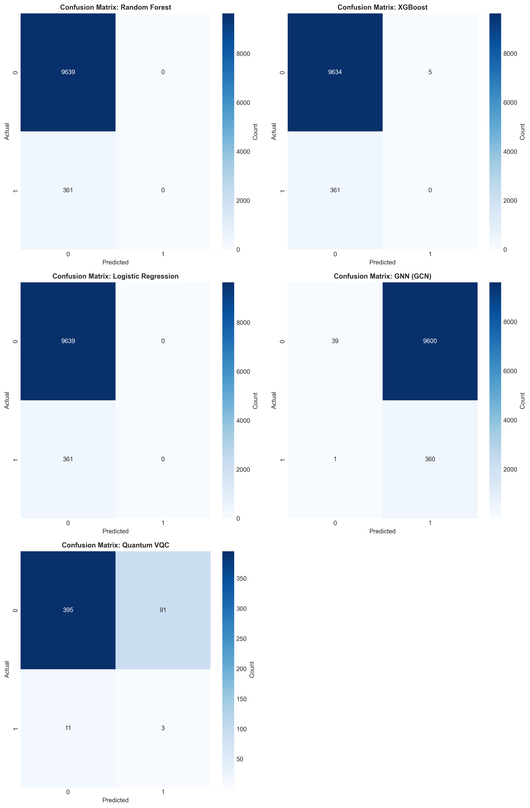
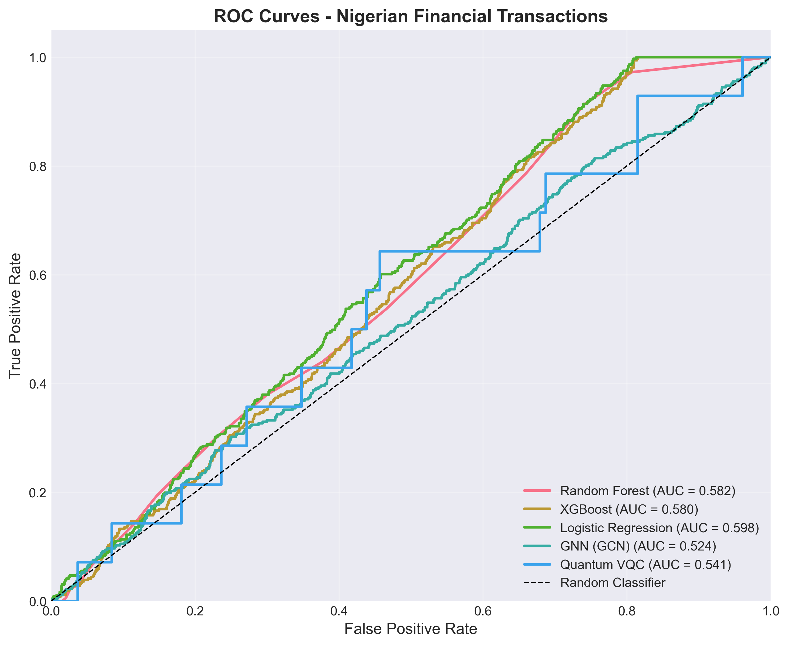
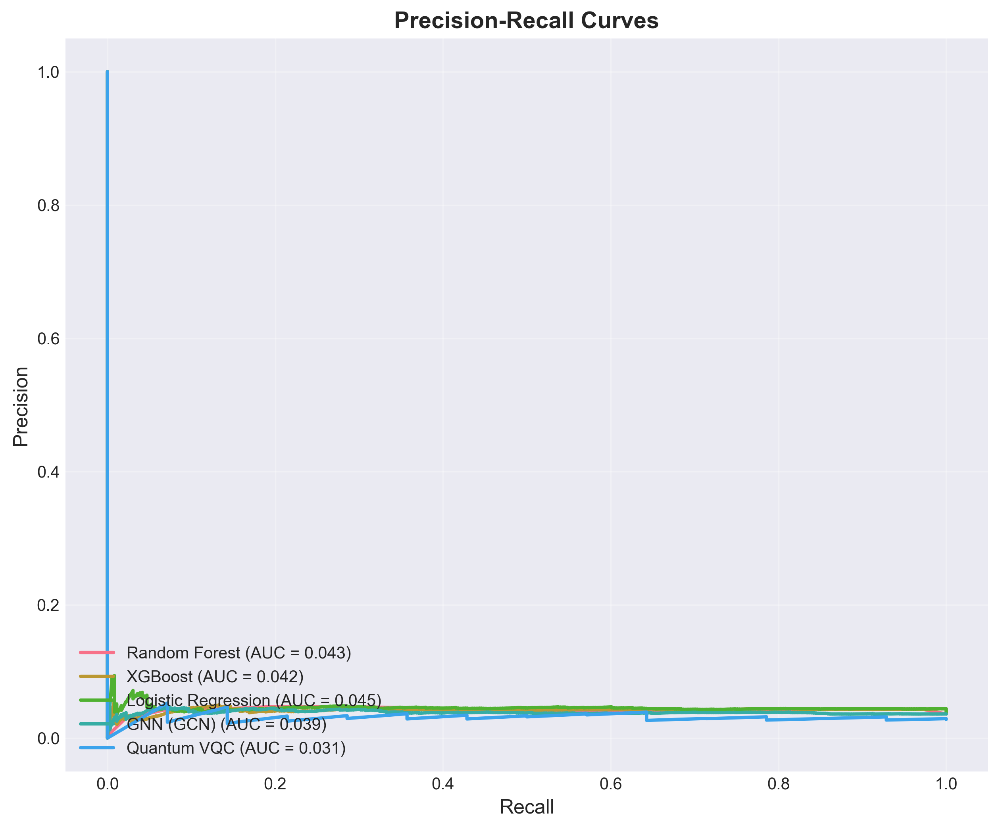
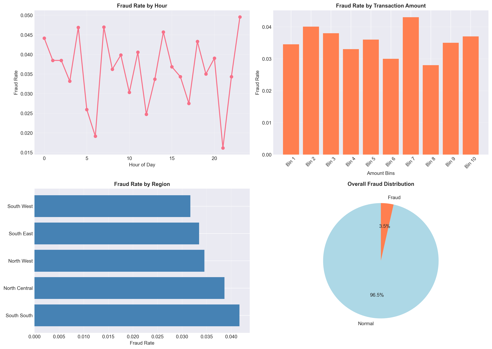
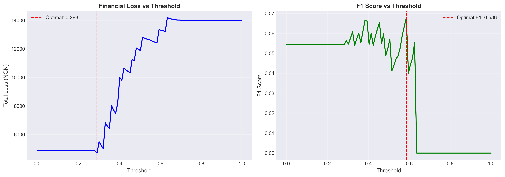

# Time-Aware GNN and Quantum-Enhanced Framework for Cost-Sensitive Financial Fraud Detection

A research-grade fraud detection pipeline comparing **Graph Convolutional Networks (GCN)**, **Variational Quantum Circuits (VQC)**, and classical ML baselines on 50,000 real Nigerian financial transactions — with time-aware splitting, heterogeneous graph construction, and cost-sensitive threshold optimization.


---

## Overview

This project detects financial fraud by combining three paradigms:

- **Classical ML** — Random Forest, XGBoost, Logistic Regression
- **Graph Neural Network** — GCN trained on a heterogeneous transaction-entity graph (devices, accounts, IPs, merchants, regions)
- **Quantum ML** — Variational Quantum Circuit (VQC) and Quantum Kernel SVM via PennyLane

A key focus is **cost-sensitive evaluation**: rather than optimizing accuracy on imbalanced data, models are evaluated by financial loss (₦1,000 per missed fraud vs. ₦10 per false alarm).

---

## Results

| Model | Accuracy | Recall | F1-Score | ROC-AUC | Total Loss (₦) |
|---|---|---|---|---|---|
| Random Forest | 96.4% | 0.0% | 0.000 | 0.582 | 361,000 |
| XGBoost | 96.3% | 0.0% | 0.000 | 0.580 | 361,050 |
| Logistic Regression | 96.4% | 0.0% | 0.000 | 0.598 | 361,000 |
| **GCN (GNN)** | 4.0% | **99.7%** | 0.070 | 0.524 | **97,000** |
| Quantum VQC | 79.6% | 21.4% | 0.056 | 0.541 | 11,910* |

*Evaluated on a 500-sample subset due to simulation cost.

**Key finding:** Classical models achieve high accuracy by predicting every transaction as legitimate — detecting zero fraud. The GCN catches 360/361 fraudulent transactions through relational risk propagation, reducing total financial loss by 73%.

---

## Visualizations

### Confusion Matrices


> Classical models (RF, XGBoost, LR) predict all transactions as legitimate — zero true positives. The GCN correctly identifies 360/361 fraud cases. Quantum VQC detects 3/14 on a 500-sample subset.

---

### ROC Curves


> All models hover near the random baseline (AUC ~0.52–0.60), reflecting the difficulty of the time-aware split where test transactions represent future, distributional-shifted fraud patterns. Logistic Regression achieves the best classical AUC (0.598).

---

### Precision-Recall Curves


> PR-AUC scores are uniformly low (~0.03–0.045) due to severe class imbalance (3.5% fraud rate). The Quantum VQC shows a sharp precision spike near zero recall, reflecting high-confidence predictions on a small subset.

---

### Fraud Distribution


> Dataset exhibits 3.5% overall fraud rate. Fraud rate varies by hour (peaks at ~23:00), by transaction amount (Bin 7 highest at ~4.5%), and by region (South South highest). No single dimension fully separates fraud from legitimate transactions.

---

### Threshold Optimization (GCN)


> Cost-sensitive threshold optimization on the GCN validation window identifies **optimal threshold = 0.293**, minimizing total financial loss. The F1-optimal threshold (0.586) diverges significantly, illustrating why financial loss — not F1 — is the correct objective for fraud detection.

---

## Project Structure

```
├── src/
│   ├── dataset_loader.py               # Nigerian dataset loading & sampling
│   ├── feature_engineering.py          # Temporal, behavioral, merchant & geo features
│   ├── data_preprocessing.py           # RobustScaler, time-aware splitting
│   ├── classical_models.py             # RF, XGBoost, Logistic Regression wrappers
│   ├── gnn_models.py                   # Heterogeneous graph construction + GCN classifier
│   ├── quantum_models.py               # VQC and Quantum Kernel SVM (PennyLane)
│   ├── quantum_feature_maps.py         # Angle, amplitude & re-uploading encoding
│   ├── cost_sensitive.py               # Asymmetric loss & threshold optimization
│   ├── evaluation.py                   # Metrics computation & model comparison
│   ├── explainability.py               # SHAP, permutation importance, sensitivity
│   ├── robustness.py                   # Dataset size, label noise, imbalance tests
│   └── visualization.py                # ROC, PR curves, confusion matrices, plots
├── scripts/
│   ├── main_advanced.py                # Full pipeline: train all models & evaluate
│   ├── flagged_transactions_gnn.py     # Generate flagged transaction report (GNN)
│   └── compute_fraud_probability_demo.py  # Step-by-step probability walkthrough
├── data/
│   ├── plots/
│   │   ├── confusion_matrices.png      # Confusion matrices for all models
│   │   ├── roc_curves.png              # ROC curves comparison
│   │   ├── pr_curves.png               # Precision-Recall curves comparison
│   │   ├── fraud_distribution.png      # Fraud rate by hour, amount, region
│   │   └── threshold_optimization.png  # Financial loss vs threshold (GCN)
│   ├── gnn_predictions.csv             # Full test set predictions with probabilities
│   ├── flagged_transactions_gnn.csv    # High-risk flagged transactions
│   ├── cluster_evidence_gnn.csv        # Fraud ring cluster analysis
│   └── model_comparison.csv            # Metrics for all models
└── README.md
```

---

## Installation

```bash
git clone https://github.com/FinoMaxwel/Time-Aware-GNN-and-Quantum-Enhanced-Framework-for-Cost-Sensitive-Financial-Fraud-Detection.git
cd Time-Aware-GNN-and-Quantum-Enhanced-Framework-for-Cost-Sensitive-Financial-Fraud-Detection
pip install -r requirements.txt
```

**Requirements:**
```
numpy
pandas
scikit-learn
xgboost
torch
torch-geometric
pennylane
matplotlib
seaborn
```

---

## Dataset

This project uses the **Nigerian Financial Transactions and Fraud Detection Dataset (V2)** from Kaggle.

1. Download from: [Kaggle — Nigerian Financial Transactions Dataset](https://www.kaggle.com/datasets/bernatferragut/nigerian-financial-transactions-and-fraud-detection)
2. Place the CSV file in:
```
data/Nigerian-Financial-Transactions-and-Fraud-Detection-Dataset/
```

The pipeline samples 50,000 transactions by default (configurable via `sample_size` in `main_advanced.py`).

---

## Usage

**Run the full pipeline (all models):**
```bash
python scripts/main_advanced.py
```

**Generate flagged transactions report (GNN only):**
```bash
python scripts/flagged_transactions_gnn.py
```

**Understand how fraud probability is computed:**
```bash
python scripts/compute_fraud_probability_demo.py
```

Outputs are saved to `data/` (CSVs) and `data/plots/` (visualizations).

---

## Methodology

### Time-Aware Splitting
Transactions are sorted chronologically and split 80/20 — the model trains on past data and predicts future transactions, preventing data leakage. The GNN uses a further 90/10 split within the training window for validation and threshold tuning.

### Graph Construction
A heterogeneous bipartite graph connects each transaction to shared entity nodes across 7 columns:

```
sender_account · receiver_account · device_hash · ip_address
merchant_category · location · ip_geo_region
```

Entity nodes are initialized with historical fraud rate statistics computed exclusively from training data, enabling risk propagation: a transaction sharing a device with past fraud cases receives elevated risk through GCN message passing.

### Cost-Sensitive Threshold Optimization
The GCN decision threshold is tuned on the validation window by minimizing:

```
Cost = (False Negatives × ₦1,000) + (False Positives × ₦10)
```

**Optimal threshold found: 0.293** — significantly lower than the default 0.5, reflecting the 100:1 cost asymmetry between missing fraud and generating false alarms.

---

## Related Work

> Innan, N., et al. (2024). Financial Fraud Detection using Quantum Graph Neural Networks. *Quantum Machine Intelligence, 6*(1), 7. https://doi.org/10.1007/s42484-024-00143-6

---

## License

This project is for academic research purposes. See [LICENSE](LICENSE) for details.
